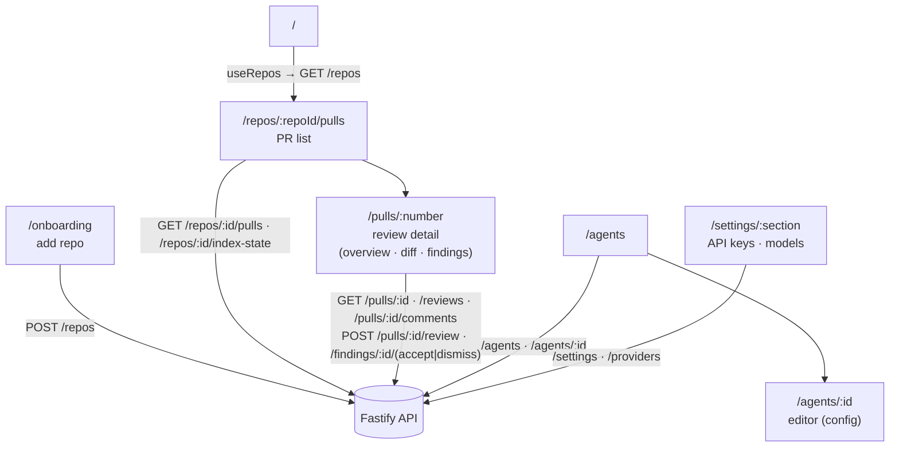

# `@devdigest/web` — architecture

How the studio is organised: routes, data, state, presentation. The short map is [../CLAUDE.md](../CLAUDE.md); what each screen must do is [../specs/ui-flows.md](../specs/ui-flows.md).

## Composition

```
app/<route>/page.tsx          thin: params, data hooks, layout, tab state
  └─ _components/<Name>/      feature UI colocated with the route
components/                   cross-route chrome (app shell, diff viewer, page shell)
vendor/ui                     design system: tokens → primitives → kit → charts → shell
lib/hooks → lib/api           the only path to the network
vendor/shared                 Zod contracts shared with the server
```

## Route map

Routes (`src/app/**/page.tsx`) and the API surface each leans on, via `src/lib/hooks/*` → `src/lib/api.ts`:



Pages are thin; feature logic sits in colocated `_components/<Name>/` folders, each with its own `*.test.tsx`.

## Data layer

`lib/api.ts` wraps `fetch` with the API base URL, JSON headers (declared only when a body is actually sent), and error normalisation into `ApiError` carrying `status`, `code`, and `details` from the server envelope. A transport failure becomes `status: 0`, `code: "network_error"`.

Every endpoint is consumed through a TanStack Query hook in `lib/hooks/`, grouped by domain: `core` (workspace, settings, repos, pulls), `agents`, `reviews`, `trace`, `repo-intel`. Query keys are tuples such as `["reviews", prId]`; mutations invalidate the keys they affect rather than refetching manually.

## Run lifecycle in the UI

1. `POST /pulls/:id/review` returns run ids immediately.
2. The PR detail page subscribes to `GET /runs/:id/events` (SSE) for the live log, and simultaneously polls `/pulls/:id/runs/active` and `/pulls/:id/runs` while anything is running.
3. Because active runs come from the server, a reload or a switch to another device still shows the run in flight.
4. When a run settles, both the run history and the reviews queries are invalidated so a just-failed run appears without a reload.
5. The persisted trace is read from `/runs/:id/trace` and rendered in the trace drawer, opened via `?trace=<runId>`.

## Error UX taxonomy

| Situation | Treatment |
|---|---|
| Mutation failed, page still usable | toast |
| One section's data failed | inline `ErrorState` with retry |
| The API is unreachable, or the route's primary entity is missing | full-screen state (`ErrorState`, `RepoNotFound`) |

## Design system

`src/vendor/ui` is one import surface (`@devdigest/ui`) with one stylesheet, themed entirely through CSS variables. Layers: `primitives/tokens.ts` (severity and category maps), `primitives/` (buttons, badges, cards, states), `kit/` (modal, drawer, tabs, form inputs), `charts/`, `shell/` (app frame, sidebar, topbar, repo switcher), plus the command palette. See [../src/vendor/ui/README.md](../src/vendor/ui/README.md).

## Shell and navigation

`src/components/app-shell` provides navigation, breadcrumbs, the active-repo context, global `g`-then-key shortcuts, and the command palette. `lib/repo-context.tsx` keeps the active repo across routes and drives the not-found state for an unknown repo id.

## Internationalisation

`next-intl` with messages in `messages/<locale>/<namespace>.json`, configured in `src/i18n/request.ts`. Namespaces map to feature areas; several exist for features added in later lessons.

## Testing

`*.test.tsx` next to the component, vitest + jsdom + Testing Library, `fetch` mocked in `src/test/setup.ts`. Tests assert rendered behaviour at the component seam, not implementation details. Real browser journeys (client + API + seeded DB) live in [../../e2e/README.md](../../e2e/README.md) and the `e2e-web.yml` workflow.
