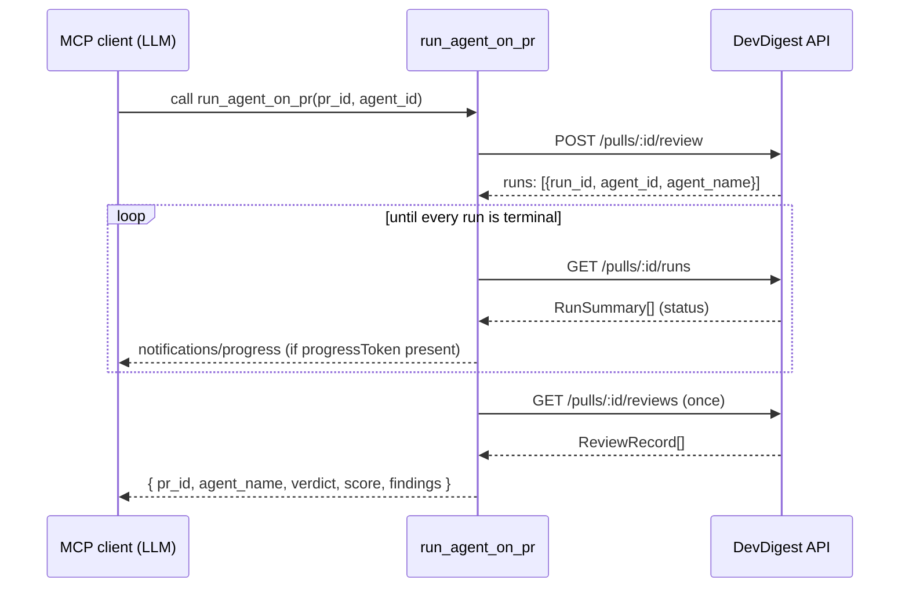

# Tools

## Design principles

Every tool in this server follows four rules (full rationale and invariant numbers in [`../specs/tool-contract.md`](../specs/tool-contract.md)):

1. **Result, not operation.** A tool returns the outcome the caller wants, not a handle to poll. `run_agent_on_pr` creates the run(s), waits for them, and collects the findings in one call.
2. **Flat arguments.** Every input is a top-level scalar or an array of scalars; ids are separate named scalars (`pr_id`, `agent_id`, `run_id`, `repo_id`). No nested objects.
3. **Concise structured response.** The default (`response_format: "concise"`) is the smallest useful answer. Run bookkeeping, ids nothing consumes, and long text sit behind `"detailed"`.
4. **Error leads onward.** Every error or empty result names the next concrete tool call or action, never a bare status code.

---

## `list_agents`

**Endpoint:** `GET /agents` — `server/src/modules/agents/routes.ts:74-77` → `AgentsService.list(workspaceId)`.

| Param | Type | Default | Notes |
|---|---|---|---|
| `enabled_only` | boolean | `false` | Only agents that run in "all agents" mode |
| `response_format` | `"concise" \| "detailed"` | `"concise"` | |

**Concise example:**

```json
{ "agents": [{ "id": "a1", "name": "Security Reviewer", "description": "...", "provider": "openai", "model": "gpt-5", "enabled": true }] }
```

**Detailed** adds every `Agent` field (`system_prompt`, `output_schema`, `version`, `strategy`, `ci_fail_on`, `repo_intel`).

**Errors / empty:**
- API unreachable → `DevDigest API unreachable at <apiBase> — start it with ./scripts/dev.sh, then retry.`
- Zero agents → `note`: "No agents configured — ask the user to create one in the DevDigest UI (Agents page)."
- `enabled_only:true` filters everything out → `note`: "No enabled agents — call list_agents without enabled_only and pass one as agent_id to run_agent_on_pr."

---

## `run_agent_on_pr`

**Trigger:** `POST /pulls/:id/review`, body `{ agentId? } | { all? }` — `server/src/modules/reviews/routes.ts:27-44`, rate-limited to **10/min** (`:29`).
**Poll:** `GET /pulls/:id/runs` — `reviews/routes.ts:101-104` → `repository.ts:85`.
**Collect:** `GET /pulls/:id/reviews` (same endpoint as `get_findings`, called once after every run is terminal).

This tool performs all three steps in one blocking call (principle 1) — see the sequence below.

| Param | Type | Default | Notes |
|---|---|---|---|
| `pr_id` | string (uuid) | — | DevDigest PR id, not the GitHub PR number |
| `agent_id` | string | — | Exactly one of `agent_id` / `all_agents` |
| `all_agents` | boolean | — | Run every enabled agent instead of one |
| `timeout_seconds` | int 30–900 | 300 | Max wait for the review(s) |
| `max_findings` | int 1–100 | 50 | Findings returned before truncation |
| `response_format` | `"concise" \| "detailed"` | `"concise"` | |

### Example 1 — single agent, concise

```json
{ "pr_id": "pr-uuid", "agent_name": "Security Reviewer", "verdict": "request_changes", "score": 62, "findings": [ { "severity": "CRITICAL", "category": "security", "title": "...", "file": "a.ts", "start_line": 10, "end_line": 12, "confidence": 0.9 } ] }
```

### Example 2 — all agents, disagreeing verdicts

```json
{ "pr_id": "pr-uuid", "results": [ { "agent_name": "Security Reviewer", "verdict": "request_changes", "score": 62, "findings_count": 2 }, { "agent_name": "Style Reviewer", "verdict": "approve", "score": 95, "findings_count": 0 } ], "findings": [ { "severity": "CRITICAL", "category": "security", "title": "...", "file": "a.ts", "start_line": 10, "end_line": 12, "confidence": 0.9, "agent_name": "Security Reviewer" } ] }
```

There is never a combined top-level `verdict` when agents disagree — each one's verdict is on its own `results[]` line.

### Example 3 — truncated

```json
{ "pr_id": "pr-uuid", "agent_name": "Security Reviewer", "verdict": "request_changes", "score": 40, "findings": [ /* first max_findings items */ ], "truncated": true, "total_findings": 37, "next": "call get_findings with pr_id=pr-uuid and run_id=run-uuid and offset=2 for the rest" }
```

**Errors (every one names the next step):**
- Neither/both of `agent_id`/`all_agents` → "Pass exactly one of agent_id (call list_agents to get one) or all_agents:true."
- Unknown agent (404) → "Agent <id> not found — call list_agents and use an agent's id as agent_id."
- Rate limit (429) → "DevDigest rate limit hit (review runs are capped at 10/minute) — wait about 60s, then retry run_agent_on_pr with the same arguments."
- A run failed/cancelled → names the run's own error and says to retry `run_agent_on_pr`, or add an API key in DevDigest Settings if the error names one missing.
- Timeout → "Timed out after <s>s waiting for run(s) <ids> ... — call get_findings with pr_id=<id> ... in a minute or two." The server-side run is **never** cancelled.
- A triggered run vanishes from `/runs` → "Run <id> disappeared from the PR run history (deleted?) — retry run_agent_on_pr with the same arguments."

### Sequence (principle 1: create → wait → collect, one call)



---

## `get_findings`

**Endpoint:** `GET /pulls/:id/reviews` — `reviews/routes.ts:129-132` → `service.ts:160-174`.

| Param | Type | Default | Notes |
|---|---|---|---|
| `pr_id` | string (uuid) | — | |
| `run_id` | string | — | Only findings from this review run |
| `agent_id` | string | — | Only findings from this agent |
| `severity` | array of `CRITICAL\|WARNING\|SUGGESTION` | — | |
| `include_dismissed` | boolean | `false` | |
| `limit` | int 1–100 | 25 | |
| `offset` | int ≥0 | 0 | |
| `response_format` | `"concise" \| "detailed"` | `"concise"` | |

**Concise example:**

```json
{ "pr_id": "pr-uuid", "results": [ { "run_id": "run-uuid", "agent_name": "Security Reviewer", "verdict": "request_changes", "score": 62, "findings_count": 2 } ], "total": 2, "next_offset": null, "findings": [ { "severity": "CRITICAL", "category": "security", "title": "...", "file": "a.ts", "start_line": 10, "end_line": 12, "confidence": 0.9, "agent_name": "Security Reviewer", "run_id": "run-uuid" } ] }
```

**Detailed** adds `reviews[]` (with `summary`, `created_at`, `model`, `grounding`) and finding `id`, `review_id`, `rationale`, `suggestion`, `kind`, `accepted_at`, `dismissed_at`, `trifecta_components`, `evidence`.

**Errors / empty:**
- No reviews at all → `note`: "No reviews yet for this PR — call run_agent_on_pr with this pr_id and an agent_id from list_agents."
- Filters leave zero findings → `note` naming which filter to drop, or to set `include_dismissed:true`.
- `run_id` matches no review → `note`: "No review for run_id <id> on this PR — omit run_id, or use a run_id from results." (`results` is recomputed without the `run_id` filter so the caller can see valid ones.)
- Unknown PR (404) → "Pull request <id> not found — pr_id must be the DevDigest PR uuid, not the GitHub PR number — ask the user for it (DevDigest UI: Repos → Pull requests)."

---

## `get_conventions`

**Endpoint:** `GET /repos/:id/conventions` — `server/src/modules/conventions/routes.ts:45-48` → `service.ts:72-76`.

| Param | Type | Default | Notes |
|---|---|---|---|
| `repo_id` | string (uuid) | — | Conventions are per repo, not per PR |
| `status` | `pending\|accepted\|rejected` | — | |
| `category` | one of the 11 convention categories | — | |
| `limit` | int 1–100 | 50 | |
| `offset` | int ≥0 | 0 | |
| `response_format` | `"concise" \| "detailed"` | `"concise"` | |

**Concise example:**

```json
{ "repo_id": "repo-uuid", "total": 1, "next_offset": null, "conventions": [ { "category": "naming", "rule": "Use camelCase for variables", "status": "accepted", "confidence": 0.9 } ] }
```

**Detailed** adds `id`, `origin`, `rationale`, `evidence` (`path`, `line`, `snippet`), `created_at`.

**Errors / empty:**
- No conventions extracted yet → `note` pointing at the repo's Conventions page in the DevDigest UI.
- Filters remove everything → `note` naming the filter to drop.
- Unknown repo (404) → "Repo <id> not found — repo_id must be the DevDigest repo uuid (a PR id will not work) — ask the user for it (DevDigest UI: Repos)."

---

## `get_blast_radius` (mock)

**No endpoint.** `server/src/modules/index.ts:29-42` registers no blast module; the in-process facade (`repo-intel/service.ts:220`, `types.ts:147`) is not reachable over HTTP in this lesson. This tool makes **no** HTTP call and always returns the same static `BlastRadius` sample.

| Param | Type | Notes |
|---|---|---|
| `pr_id` | string (uuid) | Not used by the mock, required for a consistent interface |
| `changed_files` | array of strings | Ignored by the mock |

```json
{
  "changed_symbols": [{ "name": "ReviewService.runReview", "file": "server/src/modules/reviews/service.ts", "kind": "method" }],
  "downstream": [{ "symbol": "ReviewService.runReview", "callers": [{ "name": "reviewsRoutes", "file": "server/src/modules/reviews/routes.ts", "line": 37 }], "endpoints_affected": ["POST /pulls/:id/review"], "crons_affected": [] }],
  "summary": "[MOCK] Static sample — blast radius is not wired to repo-intel yet (L04). Do not base decisions on it."
}
```

There is no error path besides input validation, since no HTTP call is made.
