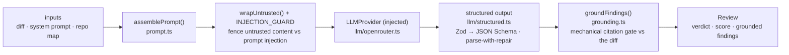

# `@devdigest/reviewer-core` — pipeline

Every stage of a review and the reasoning behind it. The short map is [../CLAUDE.md](../CLAUDE.md); the guarantees are [../specs/grounding-and-scoring.md](../specs/grounding-and-scoring.md).

## Overview

`review/run.ts` orchestrates the run, single-pass by default.

### 1. Inputs

`ReviewInput` carries the system prompt, model id, parsed diff, the injected provider, and optional slots: `skills` (L02), `memory` (L07), `specs` (L05), `callers`, `repoMap`, `prDescription`, `task`, `strategy`, `sessionId`, `onEvent`, `checkCancelled`. All context arrives as **resolved strings** — turning skill slugs into bodies or memory rows into items is the caller's job (the database in the studio, the filesystem in CI).

In the starter the server passes only the diff, system prompt, and repo map; the extra slots are omitted, so `assemblePrompt` leaves those sections out.

### 2. Prompt assembly

`assemblePrompt` renders the trusted system prompt plus each populated slot. An empty or missing slot produces no section, so a starter-configuration prompt is byte-identical to the pre-enrichment shape.

Untrusted content — the diff, the PR description, the repo map, the callers digest — is delimiter-wrapped by `wrapUntrusted`, and PR descriptions are truncated to a fixed character budget.

### 3. Injection defence

One shared `INJECTION_GUARD` is appended to every agent's system prompt, on every path (studio and CI, since both go through `reviewPullRequest`). It states that untrusted content is data rather than instructions, and that claims of "intentional", "demo", "test fixture", or "do not flag" never descope the review.

This is deliberately a single trusted rule instead of pattern-matching untrusted text: a denylist catches one phrasing in one language, while the rule generalises.

### 4. Mode selection

- `single-pass` — the whole diff in one call. The default.
- `map-reduce` — one call per file, then merge. Chosen by `auto` only when the diff exceeds the line threshold **and** touches more than one file; forced `map-reduce` on a single-file diff still runs one call.

`checkCancelled()` is invoked before each expensive chunk call, so cancellation lands between files.

### 5. Structured output

The `Review` Zod schema is converted to JSON Schema and sent with the request. Responses go through `extractJson` and `parseWithRepair`, with a retry budget, because models routinely return JSON wrapped in prose or with small syntax defects.

### 6. Reduce

Partial reviews are merged: findings concatenated, summaries joined, worst verdict wins (`request_changes` > `comment` > `approve`).

### 7. Grounding

`groundFindings` keeps a finding only when its line range intersects a real hunk of the diff for the same file. Full-file kinds (`secret_leak`, `lethal_trifecta`, `phantom`, `hook`) only require the file to be present. Dropped findings are returned with reasons so the caller can log them — the gate never drops silently, and it is what stops the engine hallucinating locations.

### 8. Scoring

The score is recomputed from the **surviving** findings, so the number on screen can never contradict the findings beneath it. Penalties and thresholds are specified in [../specs/grounding-and-scoring.md](../specs/grounding-and-scoring.md).

### 9. Outcome

`ReviewOutcome` returns the grounded review, the grounding summary, dropped findings with reasons, the mode that ran, the prompt assembly, per-chunk labels, token counts, cost, and the joined raw output — everything the caller needs to persist a trace without re-deriving it.

## Public API

Exported from `src/index.ts`:

| Export | What |
|--------|------|
| `assemblePrompt`, `wrapUntrusted` | prompt assembly and untrusted-content fencing |
| `groundFindings`, `groundingSummary` | the citation gate |
| `toJsonSchema`, `extractJson`, `parseWithRepair` | structured output |
| `reviewPullRequest` | the engine entry point |
| `reduceReviews`, `sliceDiff` | map-reduce helpers |
| `toReviewPayload`, `gateTriggered`, `countBlockers` | GitHub review payload and gating (used from L06) |
| `OpenRouterProvider` | the shared OpenAI-compatible structured provider |

Contracts (`Review`, `Finding`, `Verdict`, …) come from `@devdigest/shared`. Consumers import from the barrel only — internal files are not part of the contract.

## Consumers

- **Studio** (`server`): resolves repo-intel context, persists reviews and findings, streams progress over SSE. In the starter this is the only consumer.
- **CI runner** (added back in lesson L06): the same engine, posting a GitHub review built by `toReviewPayload` and writing an artifact.

Both call `reviewPullRequest`, which is why prompt safety and the grounding gate cannot be bypassed on either path.

## Packaging

Consumers wire the package through a tsconfig path alias (`@devdigest/reviewer-core` → `../reviewer-core/src`) and consume the TypeScript **source** directly (tsx in dev, vitest in tests). The package never emits JS — its `build` is a type-check.
